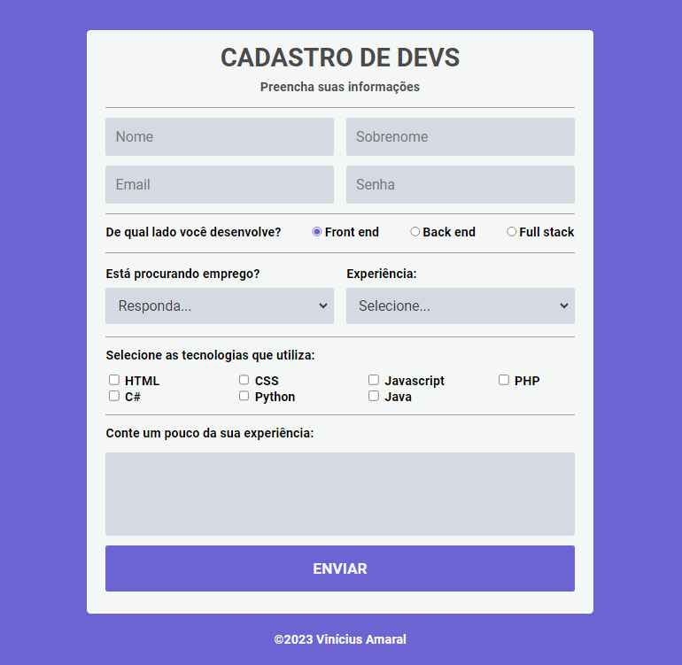

# Formulário de Cadastro
### 📄 Sobre
  Este é o front-end de um cadastro para desenvolvedores feito utilizando HTML, CSS, e Javascript para a validação do formulário:

### 🔗 Links
- [Acesse o formulário](https://amaralvinicius.github.io/formulario/)

### ✨ Tecnologias Utilziadas
- [HTML](https://developer.mozilla.org/docs/Web/HTML)
- [CSS](https://developer.mozilla.org/docs/Web/CSS)
- [Javascript](https://developer.mozilla.org/docs/Web/JavaScript)

### 📫 Contribua

1. Faça um fork do repositório
2. Crie um branch: `git checkout -b <nome_branch>`.
3. Faça suas alterações e confirme-as: `git commit -m '<mensagem_commit>'`
4. Envie para o branch original: `git push origin <nome_do_projeto> / <local>`
5. Crie a solicitação de pull.

### Desenvolvido por [Vinícius Amaral](https://github.com/AmaralVinicius/)  ⚡
